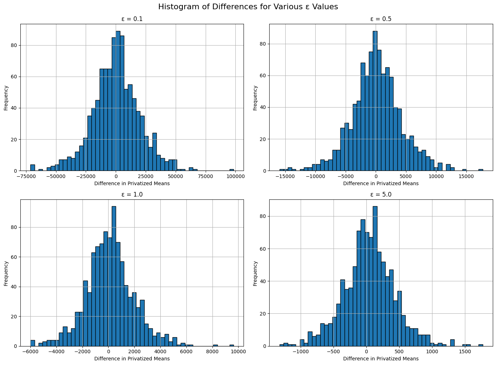
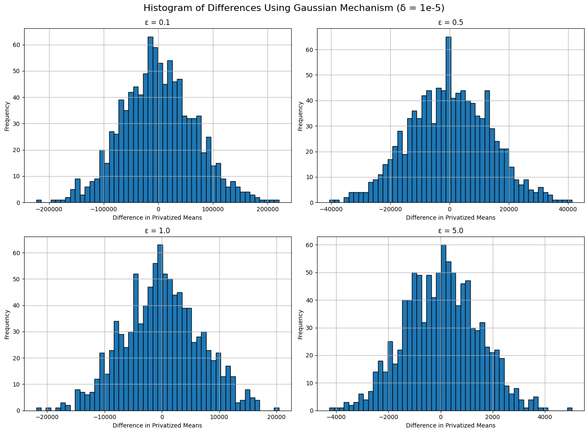
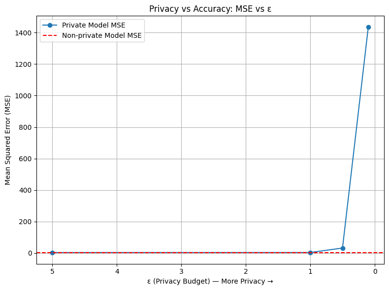
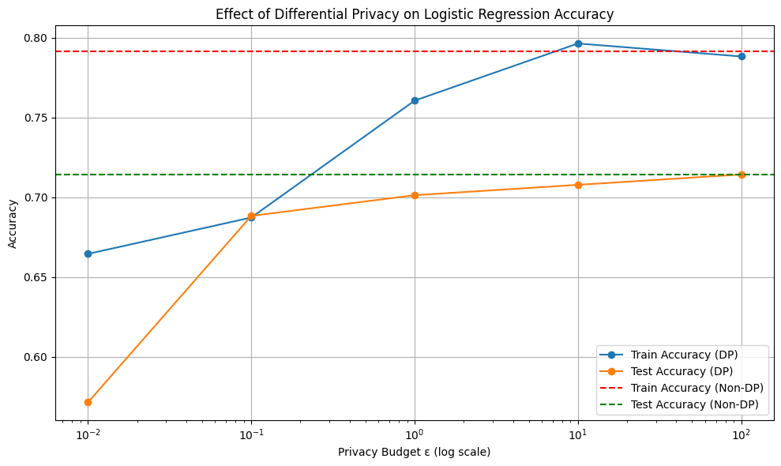

# Differential Privacy Mechanisms and Evaluation

This repository investigates the implementation and impact of Differential Privacy (DP) on statistical queries and machine learning models. It explores the trade-off between privacy protection and model utility (accuracy/error) across different DP mechanisms and privacy budgets ($\epsilon$).

## Overview

The project is divided into three main experiments:

### Part 1: Privatizing Statistical Queries
We evaluated the impact of an individual's presence or absence on the group's average income. To prevent privacy leakage, we applied:
*   **Laplace Mechanism:** Added Laplacian noise to the average[cite: 84, 108].
*   **Gaussian Mechanism:** Added Gaussian noise to the average[cite: 87, 109].
We plotted the distribution of mean differences over 1000 iterations for various privacy budgets ($\epsilon \in \{0.1, 0.5, 1.0, 5.0\}$)[cite: 85, 86, 87, 108, 109].

### Part 2: Private Linear Regression
A Linear Regression model was trained on synthetic data[cite: 88, 110]. To protect the model parameters, we applied the **Gaussian Mechanism** directly to the learned weights[cite: 89, 110]. We evaluated how different values of $\epsilon$ affect the Mean Squared Error (MSE) of the model[cite: 90, 110].

### Part 3: DP Machine Learning Models (`diffprivlib`)
Using the `diffprivlib` library, we trained differentially private classification models and compared them to standard non-private models:
*   **Logistic Regression:** Evaluated on the Diabetes dataset[cite: 91, 111].
*   **Gaussian Naive Bayes (GaussianNB):** Evaluated on the Iris dataset[cite: 93, 112].
We analyzed the model accuracy on both training and testing sets over a logarithmic scale of $\epsilon$ (from $10^{-2}$ to $10^2$)[cite: 92, 93, 111, 112].

---

## Sample Outputs

### Statistical Queries (Laplace vs. Gaussian)
Histogram of differences between privatized means with varying $\epsilon$ budgets:
<br>



### Privacy vs. Utility Trade-off (Linear Regression)
The effect of increasing the privacy budget ($\epsilon$) on the model's Mean Squared Error (MSE). A lower $\epsilon$ means higher privacy but results in a significant increase in MSE:
<br>


### Differentially Private Logistic Regression
Accuracy comparison of a standard Logistic Regression vs. a DP Logistic Regression model across different $\epsilon$ values. As $\epsilon$ increases (less privacy), the DP model's accuracy converges to the standard model's performance:
<br>


---

## Installation & Usage

1. Clone the repository:
```bash
git clone [https://github.com/yourusername/differential-privacy-eval.git](https://github.com/yourusername/differential-privacy-eval.git)
cd differential-privacy-eval
